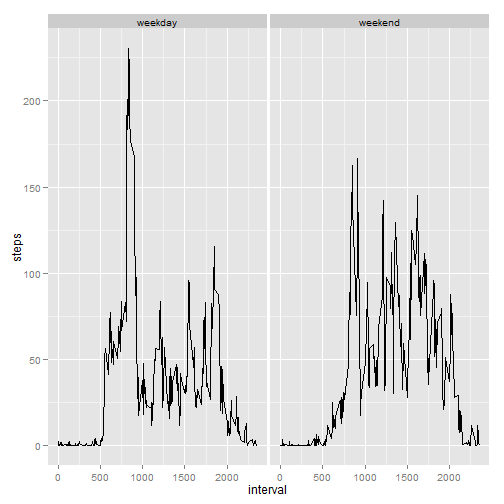

Reproducible Research Programming Assignment 1
==============================================

## import the data from working directory


```r
data <- read.csv("activity.csv")

data$date.posix <- as.POSIXlt(data$date)
```

## make histogram of total steps per day


```r
library(ggplot2)

data.agg <- aggregate(data$steps, list(date = data$date), sum)

names(data.agg) <- c("date", "steps")

hist <- ggplot(data.agg, aes(x = steps)) + geom_histogram()

print(hist)
```

```
## stat_bin: binwidth defaulted to range/30. Use 'binwidth = x' to adjust this.
```

 

## calculate mean and median total steps taken per day


```r
mean(data.agg$steps, na.rm = TRUE)
```

```
## [1] 10766.19
```

```r
median(data.agg$steps, na.rm = TRUE)
```

```
## [1] 10765
```

## create line graph of average steps by interval


```r
data.agg2 <- aggregate(data$steps, list(interval = data$interval), mean, na.rm = TRUE)

names(data.agg2) <- c("interval", "steps")

line <- ggplot(data = data.agg2, aes(x = interval, y = steps)) + geom_line()

print(line)
```

 

## find interval with maximum average steps per day


```r
max.interval <- which(data.agg2$steps == max(data.agg2$steps))

print(data.agg2$interval[max.interval])
```

```
## [1] 835
```

## calculate number of missing values


```r
summary(data)
```

```
##      steps                date          interval     
##  Min.   :  0.00   2012-10-01:  288   Min.   :   0.0  
##  1st Qu.:  0.00   2012-10-02:  288   1st Qu.: 588.8  
##  Median :  0.00   2012-10-03:  288   Median :1177.5  
##  Mean   : 37.38   2012-10-04:  288   Mean   :1177.5  
##  3rd Qu.: 12.00   2012-10-05:  288   3rd Qu.:1766.2  
##  Max.   :806.00   2012-10-06:  288   Max.   :2355.0  
##  NA's   :2304     (Other)   :15840                   
##    date.posix                 
##  Min.   :2012-10-01 00:00:00  
##  1st Qu.:2012-10-16 00:00:00  
##  Median :2012-10-31 00:00:00  
##  Mean   :2012-10-31 00:25:34  
##  3rd Qu.:2012-11-15 00:00:00  
##  Max.   :2012-11-30 00:00:00  
## 
```

## impute missing values for steps using mean steps for that interval


```r
steps.na <- which(is.na(data$steps) == TRUE)

data2 <- data

for(i in steps.na) {
        
        interval <- data$interval[i]

        row <- which(data.agg2$interval == interval)
        
        mean <- data.agg2$steps[row]
        
        data2$steps[i] <- mean
}
```

## create histogram of total number of steps taken each day using imputed data


```r
data.agg3 <- aggregate(data2$steps, list(date = data$date), sum)

names(data.agg3) <- c("date", "steps")

hist2 <- ggplot(data.agg3, aes(x = steps)) + geom_histogram()

print(hist2)
```

```
## stat_bin: binwidth defaulted to range/30. Use 'binwidth = x' to adjust this.
```

 

## calculate mean and median total steps per day using imputed data


```r
mean(data.agg3$steps)
```

```
## [1] 10766.19
```

```r
median(data.agg3$steps)
```

```
## [1] 10766.19
```

## what is the impact of imputing missing data?


```r
print("The impact of imputing 2,304 missing steps data points, using the mean number of steps for the 
      associated interval, is that the median of the new dataset is now equal to the mean.  
      The mean of the new dataset is unchanged from the mean of the old dataset.  This creates values for those
      days which previously had no values in the old dataset and were just NA for each interval.")
```

```
## [1] "The impact of imputing 2,304 missing steps data points, using the mean number of steps for the \n      associated interval, is that the median of the new dataset is now equal to the mean.  \n      The mean of the new dataset is unchanged from the mean of the old dataset.  This creates values for those\n      days which previously had no values in the old dataset and were just NA for each interval."
```

## create new factor variables for weekday and weekend


```r
data2$day <- data2$date.posix$wday + 1

days <- c("Sunday", "Monday", "Tuesday", "Wednesday", "Thursday", 
          "Friday", "Saturday")

data2$day <- days[data2$day]

weekday.index <- ifelse(data2$day == "Monday" | data2$day == "Tuesday" | data2$day == "Wednesday" | 
                                data2$day == "Thursday" | data2$day == "Friday", "weekday", "weekend")

data2$weekday <- weekday.index
```

## create two line graphs showing average steps per interval for weekdays and for weekends


```r
data.agg6 <- aggregate(data2$steps, list(interval = data2$interval, weekday = data2$weekday), mean)

names(data.agg6)[3] <- "steps"

line2 <- ggplot(data.agg6, aes(x = interval, y = steps)) + geom_line() 

line2 + facet_grid(. ~ weekday)
```

 

